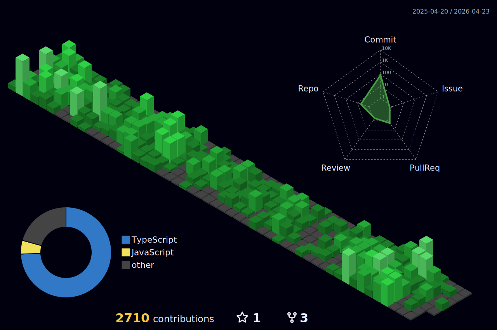

# **Olá! Eu sou o Wagner Pereira 👋**

Desenvolvedor de Produtos IA e WebServices. Crio soluções práticas e escaláveis, sempre pensando na experiência do usuário, na performance e na inovação. Minha stack abrange desde **Next.js** e **Node.js** para aplicações web modernas, **Kotlin** e **Java** para desenvolvimento Android e AndroidTV, **Tizen OS** para Smart TVs Samsung, até **Python** para automações e análises, além de tecnologias como **Electron**, **Google Cloud Services** e integrações avançadas em cloud e IA.

**Principais Tecnologias e Projetos**

- **Next.js, Node.js & Vue.js:** Desenvolvimento de aplicações web modernas, com SSR, APIs REST e integrações robustas.
- **Python:** Automação, scripts e análise de dados para soluções customizadas.
- **Kotlin & Java:** Desenvolvimento de aplicativos para Android e AndroidTV com foco em experiência do usuário e performance.
- **Electron & Tizen OS:** Criação de aplicações desktop e para dispositivos inteligentes como Smart TVs Samsung, aliando performance e design inovador.
- **mySQL & Cloud Services:** Gerenciamento de dados e integração com AWS S3 Bucket e Google Cloud Services, garantindo escalabilidade e segurança.
- **APIs de Inteligência Artificial:** Integração com **OpenAI API**, **DeepSeek** e **Anthropic** para incorporar recursos avançados de IA em projetos.
- **PHP & jQuery:** Desenvolvimento de aplicações web legadas e manutenção de sistemas existentes.

**Conquistas Recentes**

- **Aplicação Web de Alto Desempenho:** Projetos que integram Next.js, Vite e Node.js, focados em performance, escalabilidade e experiência do usuário.
- **Aplicativos Android & AndroidTV:** Desenvolvimento com Kotlin e Java de aplicações otimizadas para diferentes dispositivos e formatos de tela.
- **Smart TV Applications:** Desenvolvimento de aplicações para Smart TVs utilizando Tizen OS, criando experiências imersivas para o ecossistema Samsung.
- **Soluções Desktop:** Aplicações multiplataforma utilizando Electron, otimizadas para diferentes sistemas operacionais.
- **Automação e Data Analysis:** Criação de pipelines em Python que otimizam processos e suportam decisões estratégicas.
- **Integração Cloud & Banco de Dados:** Implementação de APIs REST integradas com AWS S3, Google Cloud e mySQL, elevando a robustez das minhas soluções.
- **Inovação com IA:** Projetos com OpenAI, DeepSeek e Anthropic, trazendo recursos de inteligência artificial de ponta para resolver problemas reais.

  
  
  
  
  
  
  
  
  
  
  
  
  
  
  
  
  

**Conecte-se Comigo**

  
  

---

Estou sempre aberto a novos desafios e parcerias que incentivem a inovação e a prática. Se algum projeto ou ideia bater com o que você precisa, bora conversar e construir soluções na lata, sem enrolação.
